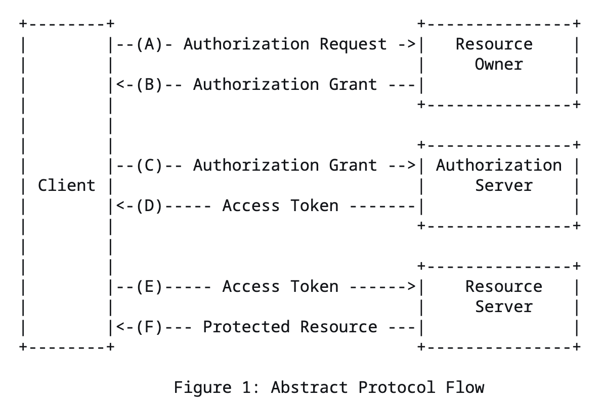

## oauth 2.0?

산업 표준 인증(authorization) 프로토콜

웹 애플리케이션, 데스크탑 애플리케이션, 모바일 및 휴대용 장치에 대해 특정 인증 흐름을 제공함

이를 통해 client 개발자가 간단하게 인증 기능을 구현하도록 도와줌

애플리케이션이 third-party 애플리케이션에 resource 제공하기 위해 resource owner의 credentials를 공유하지 않는 대신 별도의 crendentials을 발급하여 접근할 수 있도록 하는 메커니즘을 가짐

## 역할

### resource owner

protected source에 접근할 수 있는 entity

resource owner가 사람일 경우 end-user라고 칭함

### resource server

protected source를 호스팅하는 server

access token을 사용하여 resource 접근 요청을 받고 응답함

### client

resource owner를 대신하여 권한을 가지고 protected source를 요청하는 애플리케이션

여기서 말하는 client는 특정 수단이 아닌 서버, 데스크탑, 모바일 등 protected source를 요청하는 애플리케이션 자체를 말함

### authorization server

resource owner가 인증을 마치면 client에게 access token을 발급하는 server

resource server와 authorization server는 동일한 서버이거나 별도로 관리할 수 있음

단일 authorization server가 여러 resource server에서 받는 access token을 발급할 수 있음

## Abstract protocol flow

* A (authorization request 전송)
    * client가 resource owner에게 authroziation request 요청을 보냄
    * authorization server를 통하거나 resource owner에게 직접 요청을 보낸다

* B (authorization grant 수신)
    * 이후 client는 authorization grant를 받음 - resource owner의 authorization을 나타내는 credentials(자격 증명)
    * RFC 6749 명세에 따르면 authrozation grant의 유형(type)은 4가지이고, 확장 타입을 지원함
    * client가 authroziation request를 보내는 방법과 authorization server에서 지원하는 유형에 따라 grant 타입이 결정됨

* C (access token 요청)
    * client의 authrozatino server 인증과 authorization grant를 통해 client가 authorization server에 access token을 요청함

* D (access token 발급)
    * authroization server는 client를 인증하고 authrozation grant를 검증함
    * 유효하다면 acccess token 발급

* E (protected source 요청)
    * access token을 통해 client에서 resource server에 protected source를 요청함

* F (protected source 응답)
    * resource server는 access token을 검증하고, 유효하다면 요청에 응답함

## Authrozation grant

authroization grant는 resource owner의 권한을 나타내는 자격증명으로써, client가 access token을 얻을 때 사용됨

grant type은 총 4가지임 (별도의 type을 정의할 수도 있음)  

보안 수준 및 client 애플리케이션 유형 등에 따라 선택하면 됨

###  Authorization code (보통 사용되는 유형) 

resource owner가 접근 요청을 허용하면 authroization server에서 client에게 authorization code를 응답함

authorization code를 바탕으로 access token을 발급받는다  
(이 과정에서 server-to-server 요청 전송 시 client를 인증할 client_secret이 발급된다)

code를 바탕으로 access token을 주고받는 과정은 client와 authorization server, resource server 사이에서만 발생하므로  browser 등에 resource owner에 대한 데이터나 token이 노출되는 일이 없음

### Implicit

### Resource owner password credentials

### Client credentials

## 참고

[RFC 6749](https://datatracker.ietf.org/doc/html/rfc6749#section-1.1)

[bytebytego - oauth flow](https://blog.bytebytego.com/i/135955829/oauth-explained-with-simple-terms)

[frontegg - grant types](https://frontegg.com/blog/oauth-grant-types)
